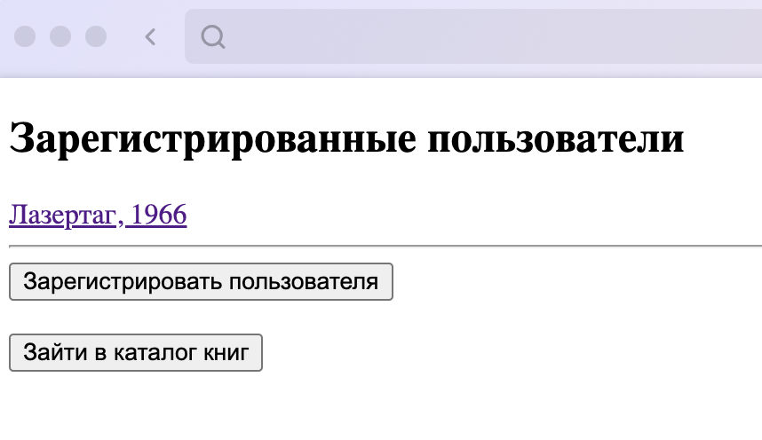
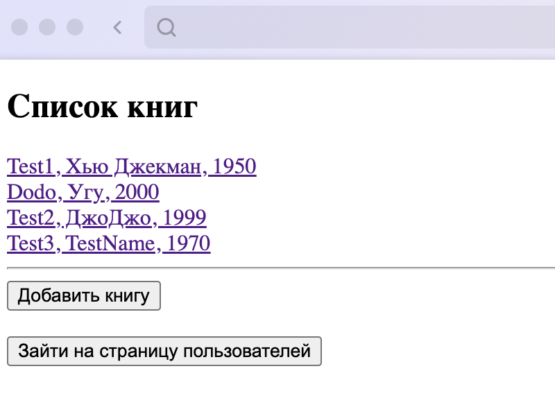
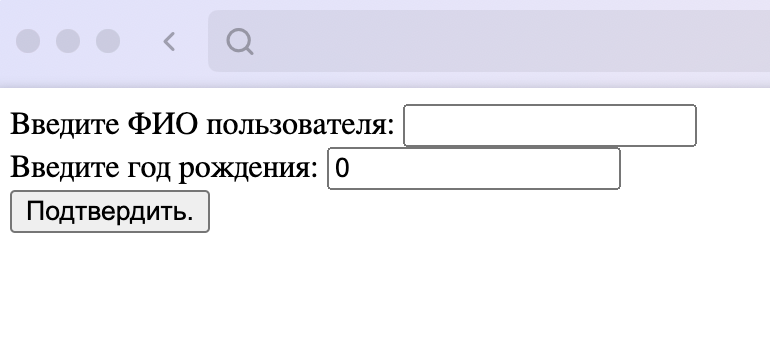
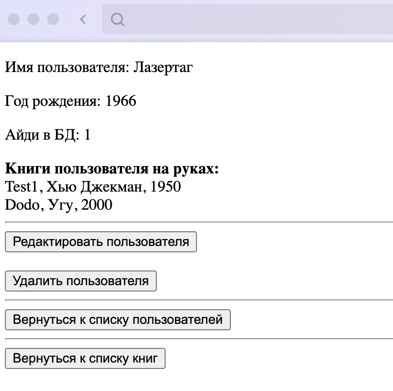
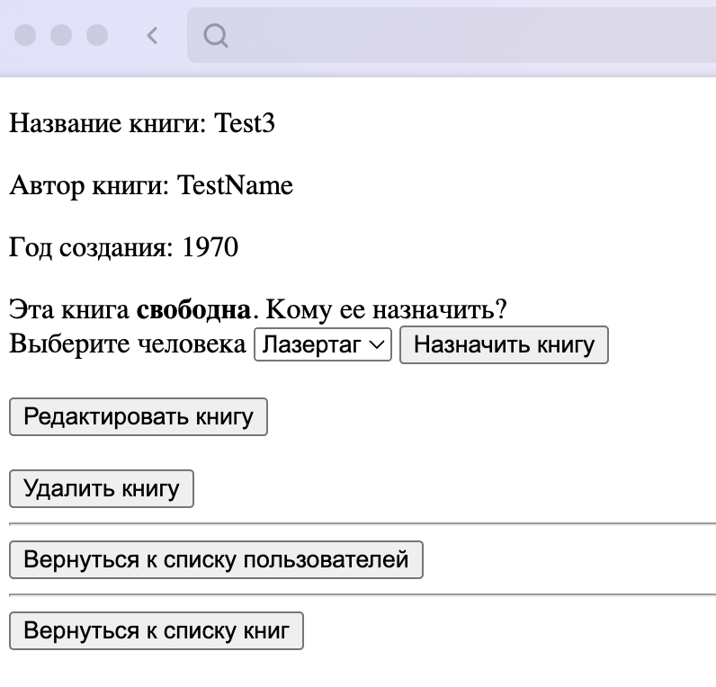
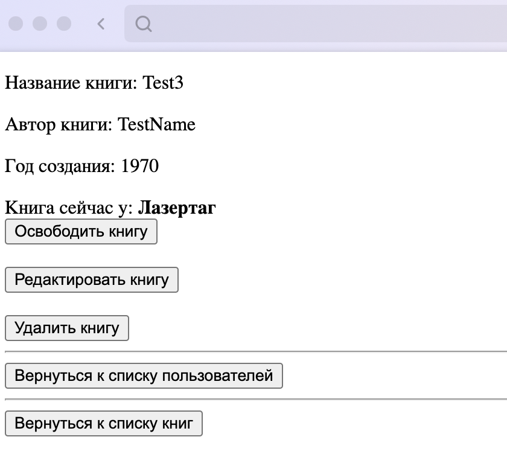
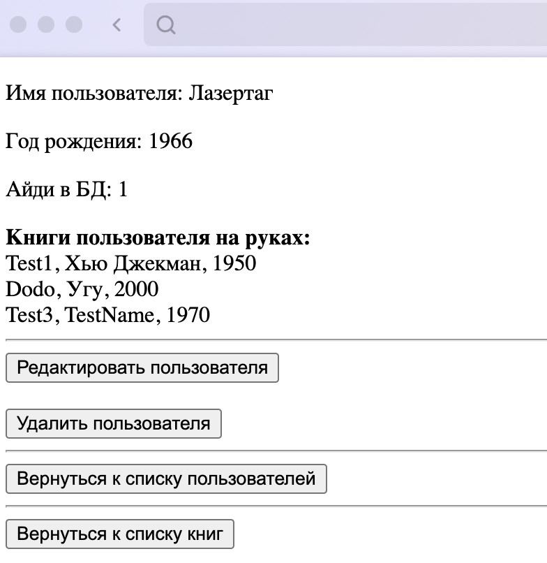
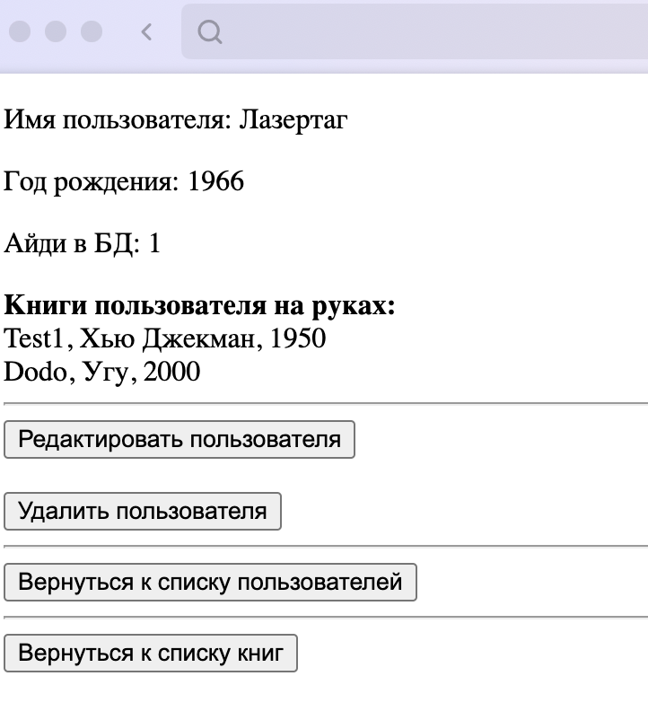

# Учебные проекты

## Library1_JDBC - учебный проект, написанный на Spring MVC через JDBC Template. Без Hibernate. 

### Задача: реализовать связь между сущностью человек и книга, установить связь один-ко-многим. Человек может принимать в свою власть всего 1 книгу. Эта книга не может быть у нескольких человек. Отображение владения книгой должно отображаться на странице у человека и у книги.

- Страница зарегистрированных пользователей по GET запросу /people. 

 
 
- Страница существующих книг в библиотеке по GET запросу /books.

 
 
- Страница регистрации пользователя. 

 
 
- Страница самого пользователя: имя, год рождения, какие книги имеются у пользователя.

 
 
- Страница самой книги: название, автор книги, год создания, кому можно назначить книгу.

 
 
- Назначили книгу одному пользователю. Теперь данная книга находится во власти пользователя.

 
 
- Теперь на странице у пользователя также отображается данная книга во владении.

 
- Удалили книгу из библиотеки - удалилась также данная книга у пользователя.

 

## Library2_JPA - учебный проект, написанный на Spring MVC с использованием Spring JPA, где под капотом Hibernate.

- 

## project3_REST - учебный проект, написанный на Spring Boot, Spring Data JPA, Spring Validator, Spring WEB с использованием БД PostgreSQL.
